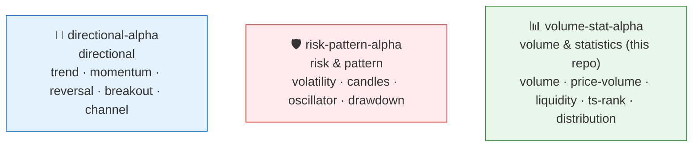
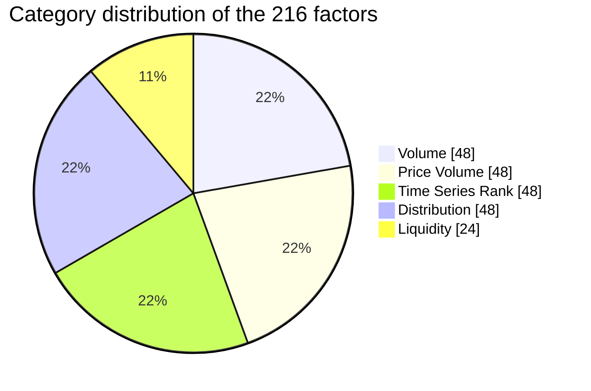
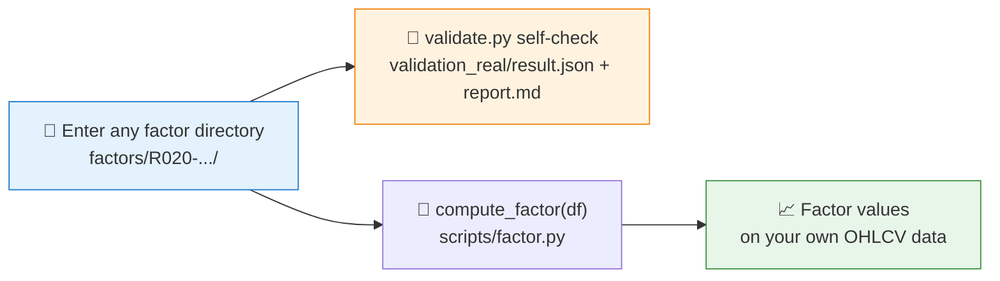

# 📊 skill-quant-factor-volume-stat-alpha

[简体中文](README.md) | **English**

> Volume, price-volume, and statistical-ranking factor library: 216 standalone OHLCV factor Skills, 216/216 validated on real market data.

<p align="center">
  
  
  
  
  
  
</p>

`skill-quant-factor-volume-stat-alpha` is the QuantSkills organization's volume, price-volume, and statistical-ranking factor Skill repository. It collects OHLCV factors that describe trading volume, dollar volume, price-volume relationships, time-series ranking, and return distribution.

QuantSkills GitHub organization: https://github.com/quantskills

This repository is suitable for researching:

- Volume expansion and volume normalization
- Dollar-volume activity and liquidity states
- Price-volume correlation and OBV slope
- Time-series ranks of close price and volume
- Return skewness and return kurtosis

## 🧭 QuantSkills Factor Library Navigation

QuantSkills splits this batch of OHLCV factors into three public Skill repositories by research purpose:



- [`skill-quant-factor-directional-alpha`](https://github.com/quantskills/skill-quant-factor-directional-alpha): directional — trend, momentum, reversal, breakout, and channel-position factors.
- [`skill-quant-factor-risk-pattern-alpha`](https://github.com/quantskills/skill-quant-factor-risk-pattern-alpha): risk & pattern — volatility, candlestick pattern, oscillator, and drawdown factors.
- [`skill-quant-factor-volume-stat-alpha`](https://github.com/quantskills/skill-quant-factor-volume-stat-alpha): volume & statistics — volume, price-volume relation, liquidity, time-series rank, and return-distribution factors.

This repository is the volume & statistics library of the three; it does not represent the entire QuantSkills factor collection.

## 📦 Repository Contents

This repository contains `216` factor Skills, keeping their original factor IDs.



| Category | Count | Description |
|---|---:|---|
| Volume | 48 | Volume expansion, volume z-score |
| Price Volume | 48 | Price-volume correlation, OBV slope |
| Liquidity | 24 | Dollar-volume activity |
| Time Series Rank | 48 | Time-series ranks of close price and volume |
| Distribution | 48 | Return skewness, return kurtosis |

## 🗂️ Single-Factor Structure

Each factor is a standalone Skill folder under `factors/`, named `<factor_id>-<english_slug>`:

```text
factors/
  R020-5d-z-scored-volume-expansion/
    SKILL.md
    README.md
    scripts/
      factor.py
      validate.py
    validation_real/
      result.json
      report.md
    references/
      formula.md
    agents/
      openai.yaml
```

## 🗃️ Data Requirements

Factor code depends only on standard OHLCV fields:

```text
date, symbol, open, high, low, close, volume
```

Recommended additional field:

```text
market
```

## 🧪 Validation Scope

Factors in this repository have been validated on a real market panel:

| Item | Scope |
|---|---|
| 🇨🇳 A-shares | 98 symbols |
| 🇺🇸 US stocks | 50 symbols |
| 📅 Sample period | 2021-01-04 to 2026-06-10 |
| ✅ Result | 216 / 216 pass |

Validation metrics include coverage, 5-day Rank IC, 5-day ICIR, quintile Q5-Q1 return spread, top-group turnover, and a no-lookahead check.

## 🚀 Usage



After entering any factor directory, run the self-check directly:

```powershell
$env:PYTHONUTF8='1'
python .\scripts\validate.py
```

Call it from code:

```python
from scripts.factor import compute_factor

result = compute_factor(df)
```

where `df` is your own OHLCV data.

## 🗂️ Index Files

| File | Contents |
|---|---|
| `factor_index.json` | Metadata index of all factors in this repository |
| `validation_summary_real.json` | Real-market validation summary of all factors in this repository |
| `repo_summary.json` | Repository-level statistics |

## 📜 License

This repository is licensed under the GNU General Public License v3.0. See [LICENSE](LICENSE).

Copyright (C) 2026 QuantSkills.

## 🐼 PandaAI / QUANTSKILLS Community

<div align="center">
  
  <br>
  <sub>Scan the QR code to join the PandaAI community for QUANTSKILLS skills, agent workflows, and quantitative research practice.</sub>
</div>
